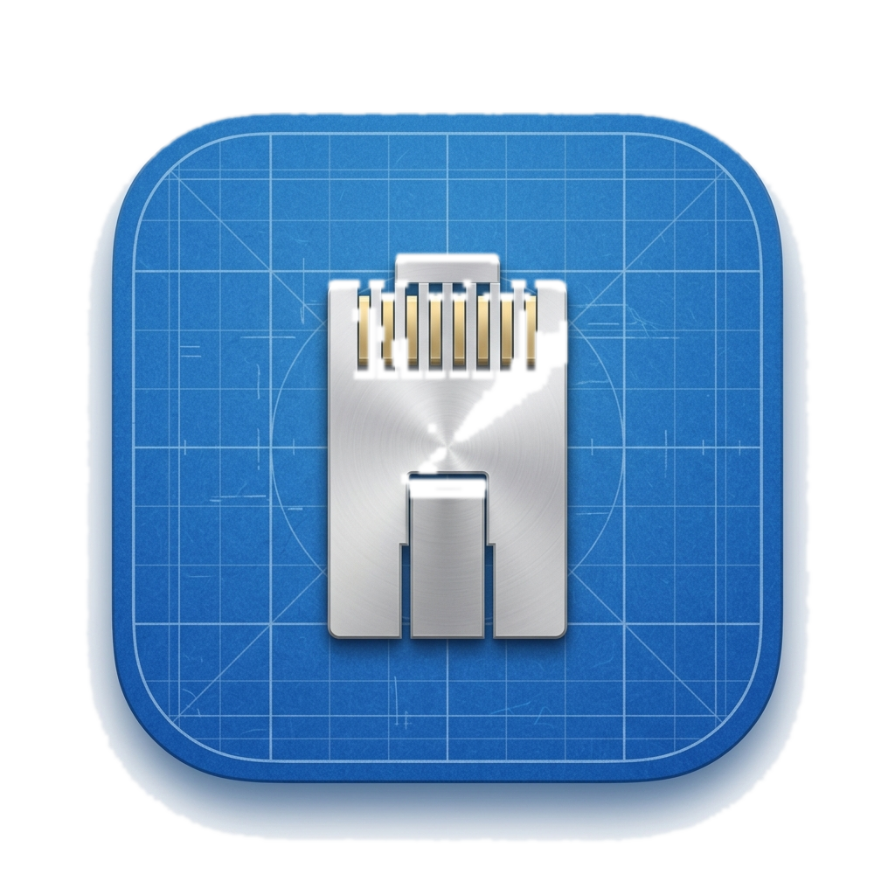

<div align="center">
  
  <h1>XNet› 🚀</h1>
  <p><b>Unified macOS Network Operations & Intelligence Suite</b></p>
  <p><i>The professional alternative for modern Network engineers.</i></p>

  [](https://apple.com)
  [](https://swift.org)
  [](LICENSE)

  <br />

  <a href="https://xnet.cloud.queiros.com.br">
    
  </a>
</div>

---

## 🌐 Full Web Portal
For detailed documentation, capabilities overview, and latest releases, please visit our official hub:
👉 **[xnet.cloud.queiros.com.br](https://xnet.cloud.queiros.com.br)**

---

## ✨ Key Features
- **Network Intelligence**: High-performance LAN & Port probing engines.
- **Advanced Diagnostics**: Visual Ping and Traceroute Hop Analytics.
- **Network Planning**: Bit-level Subnet & VLSM Calculators.
- **Unified Remote**: Protocol-aware Terminal (SSH/Telnet) & FTP orchestration.
- **Professional Storage**: Local SwiftData persistence + NetBox inventory sync.
- **Native Design**: Built 100% in Swift/SwiftUI for macOS with Apple's material design.

---

## 🛠️ Installation

```bash
# Clone the workspace
git clone https://github.com/kaua-alves-queiros/XNet.git
cd XNet

# Open and Run in Xcode 16+
open XNet›.xcodeproj
```

---

## 👥 Development Team

The research and innovation behind XNet are driven by these contributors:

<div align="center">
  <a href="https://github.com/kaua-alves-queiros/XNet/graphs/contributors">
    
  </a>
</div>

---

<div align="center">
  <p><i>“Design is not just what it looks like and feels like. Design is how it works.”</i></p>
  <b>XNet› Team</b>
</div>
