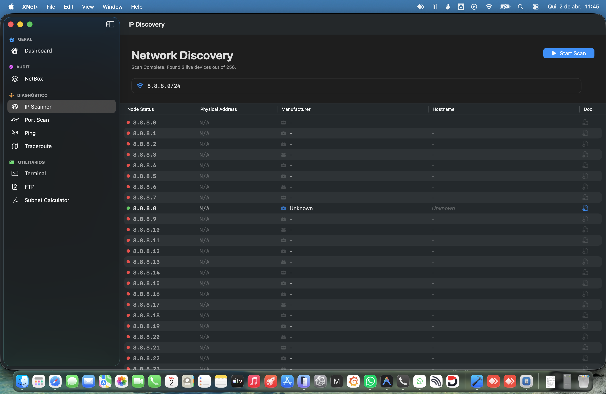
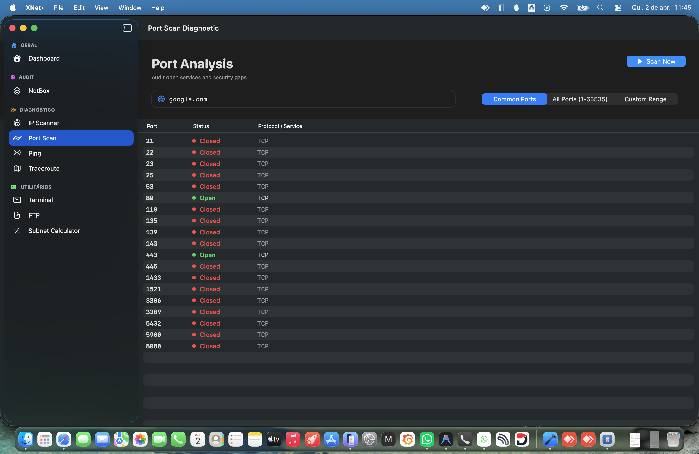
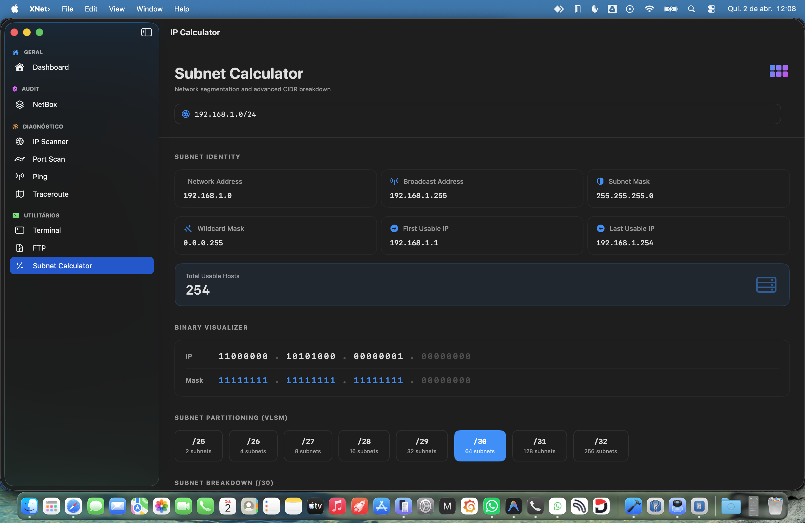
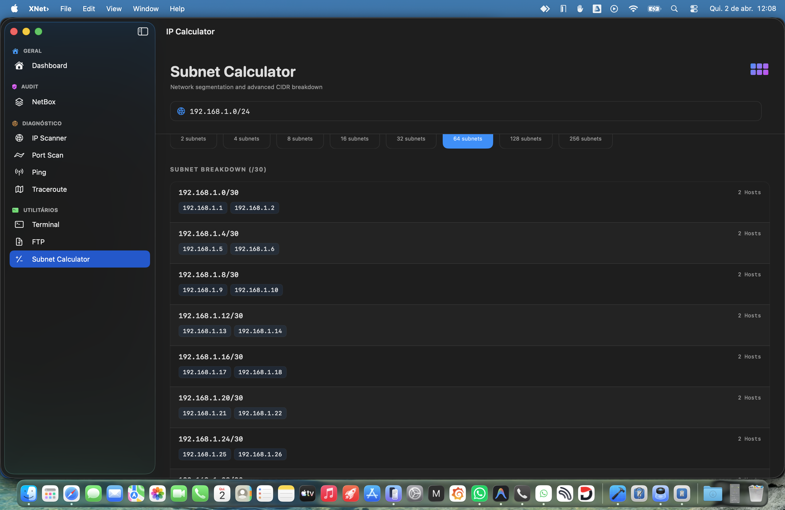
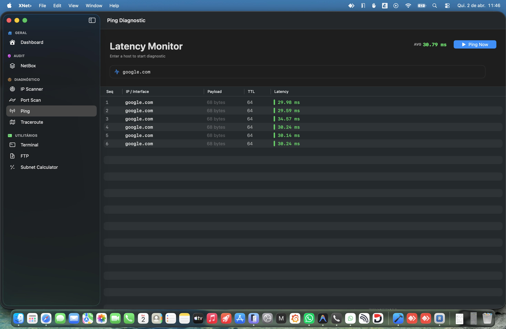
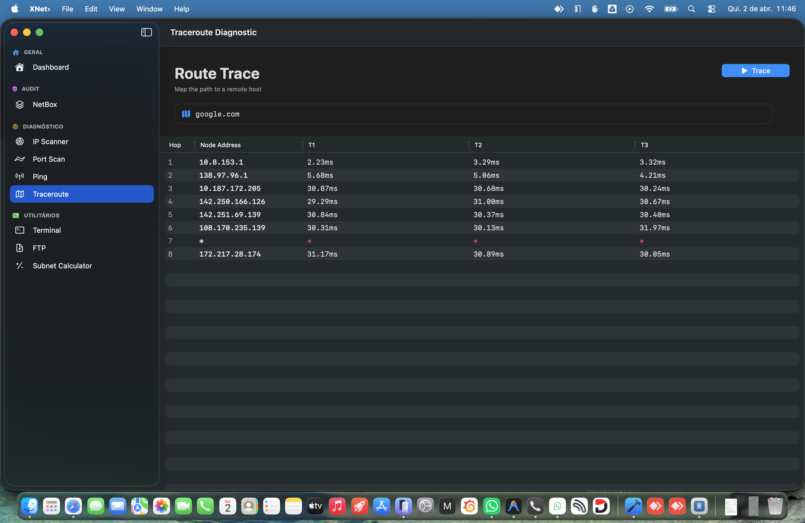
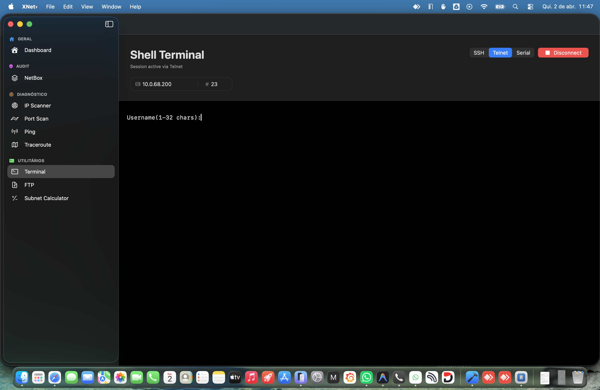
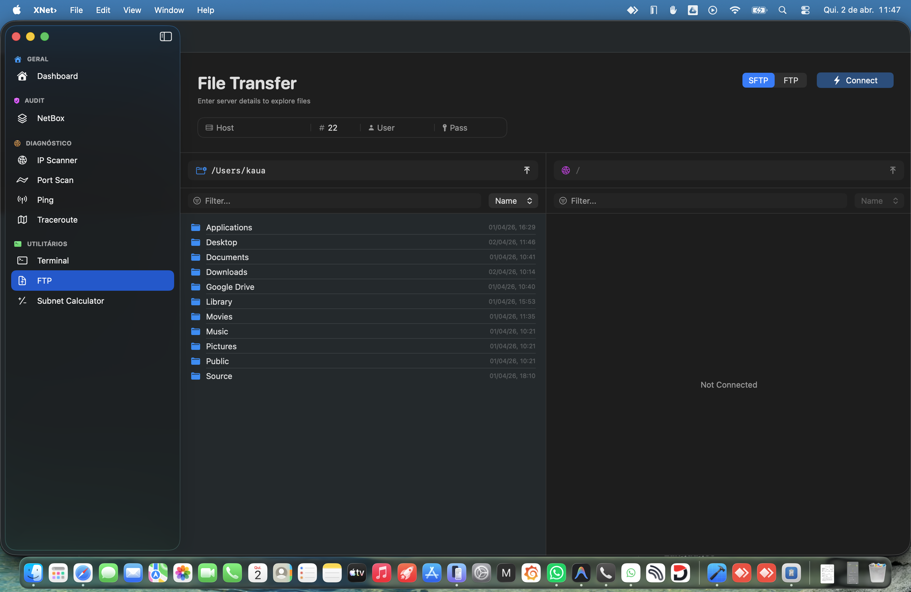

<div align="center">
  
  <h1>XNet› 🚀</h1>
  <p><b>Unified macOS Network Operations & Intelligence Suite</b></p>
  <p><i>The professional alternative for modern Network engineers.</i></p>

  [](https://apple.com)
  [](https://swift.org)
  [](LICENSE)
</div>

---

## 🔍 Network Intelligence & Discovery

Leverage high-performance probing engines to map your infrastructure in seconds.

| Device Discovery (IP Scanner) | Security Auditing (Port Scan) |
|:---:|:---:|
|  |  |
| *Real-time visualization of your local subnets.* | *Rapid service identification and vulnerability map.* |

---

## 📐 The Planner (Advanced IP/Subnet)

Precision planning with a modern touch. Calculate, partition, and visualize subnets with bit-level clarity.

| Subnet Identity | Partitioning (VLSM) |
|:---:|:---:|
|  |  |
| *Bitwise visualizer with 64-bit overflow stability.* | *Interactive usable IP list with real-time expansion.* |

---

## 🌩️ Diagnostics & Low-Level Probing

High-fidelity ICMP and routing analysis.

| Visual Ping | Traceroute Analysis |
|:---:|:---:|
|  |  |
| *History-based latency tracking and stats.* | *Routing hop mapping with visual feedback.* |

---

## 🖥️ Remote Management & Transfers

Professional-grade unified workspace for terminal sessions and secure file movement.

| Unified Terminal (SSH/Telnet/Serial) | Remote File Transfer (FTP/SFTP) |
|:---:|:---:|
|  |  |
| *Safari-inspired tab system with protocol-aware emulation.* | *Dual-pane experience for rapid file sync.* |

### Advanced Terminal Features
- **Protocol-Aware Emulation**: Specialized handling for Cisco, Mikrotik, and Linux environments.
- **Precision Line Buffer**: Real-time Carriage Return (`\r`) and Backspace (`\b`) processing for perfect Tab-Completion.
- **Smart Negotiation**: Active Telnet DONT/WONT negotiation to prevent duplicate echoes.
- **Unified Tab Bar**: Sleek, compact 32px navigation bar for high-efficiency multi-session management.

---

## ✨ Key Features
- **Smart Credential Injection**: Automatic password prompt detection and injection for rapid access.
- **SwiftData Persistence**: Local, high-performance database for NetBox, inventory, and session history.
- **Native Performance**: 100% Swift & SwiftUI (No Electron/Node.js).
- **POSIX Precision**: Direct socket and TermIOS serial communication for hardware-level reliability.
- **Modern Design**: Native macOS Safari-level aesthetic with `.ultraThinMaterial` and dynamic dark mode support.

---

## 🛠️ Architecture & Tech
- **Core Engine**: Raw Sockets (IPv4) & TermIOS (Serial).
- **Frontend**: SwiftUI (Observation API) with highly decoupled module patterns.
- **Deployment**: Ad-Hoc Signed Unsigned Distribution via GitHub Actions.

---

## 🚀 Installation

```bash
# Clone the workspace
git clone https://github.com/kaua-alves-queiros/XNet.git
cd XNet
# Open and Run in Xcode 16+
open XNet›.xcodeproj
```

---

## 👥 Development Team

The infrastructure and innovation behind XNet are driven by these contributors:

<div align="center">
  <a href="https://github.com/kaua-alves-queiros/XNet/graphs/contributors">
    
  </a>
</div>

---

<div align="center">
  <p><i>“Design is not just what it looks like and feels like. Design is how it works.”</i></p>
  <b>XNet› Team</b>
</div>
